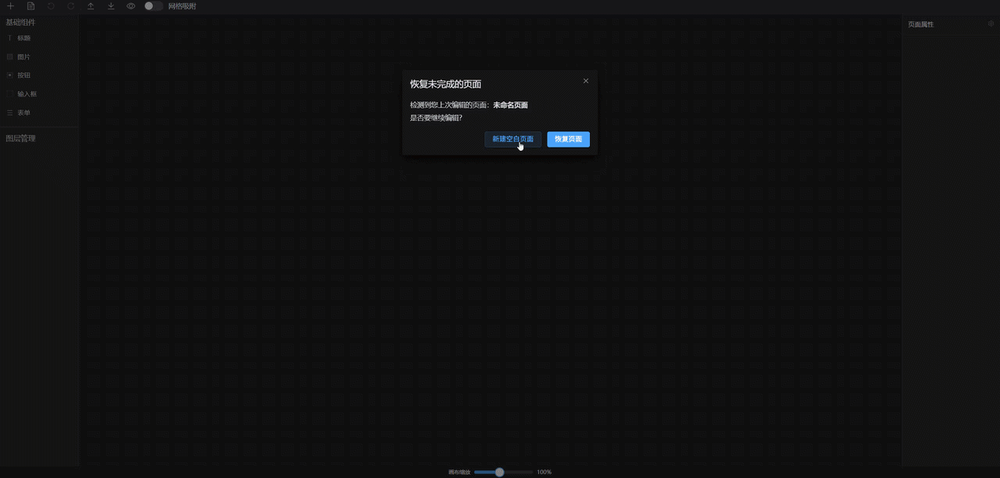
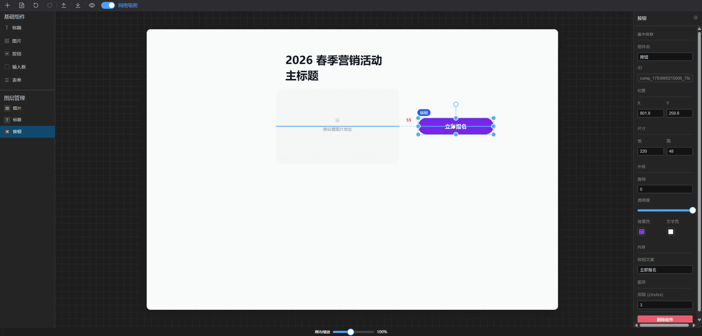

# LowCode Editor

面向营销活动与落地页场景的低代码可视化编辑器，支持拖拽组件、实时预览、撤销重做等核心功能。

> 在线体验：[https://lowcode-editor.zyanghub.cn](https://lowcode-editor.zyanghub.cn)

## 功能特性

- **可视化拖拽编辑**：基于 vue3-moveable 实现组件的自由拖拽、缩放、旋转操作
- **组件库**：内置标题、图片、按钮、输入框、表单等常用营销组件
- **撤销/重做**：基于 Command 模式实现完整的操作历史管理
- **属性面板**：Schema 驱动的属性配置面板，支持文本、颜色、选择等多种类型
- **页面预览**：一键预览页面效果，所见即所得
- **导入/导出**：支持 JSON 格式的页面数据导入导出
- **保存与恢复**：localStorage 持久化，启动时检测并提示恢复未完成的页面
- **网格吸附**：支持开启网格对齐辅助功能
- **画布缩放**：支持 25%-200% 画布缩放

## 功能演示





.gif>)

## 技术栈

- **框架**：Vue 3 (Composition API)
- **语言**：TypeScript
- **构建工具**：Vite 8
- **状态管理**：Pinia
- **路由**：Vue Router 5
- **UI 组件库**：Element Plus
- **拖拽库**：vue3-moveable
- **自动导入**：unplugin-auto-import, unplugin-vue-components, unplugin-icons

## 快速开始

### 安装依赖

```bash
npm install
```

### 开发模式

```bash
npm run dev
```

### 构建生产版本

```bash
npm run build
```

### 预览生产版本

```bash
npm run preview
```

## 项目结构

```
src/
├── components/           # 组件目录
│   ├── components/      # 可拖拽组件实现
│   │   ├── TextComponent.vue    # 文本组件
│   │   ├── ImageComponent.vue   # 图片组件
│   │   ├── ButtonComponent.vue  # 按钮组件
│   │   ├── InputComponent.vue   # 输入框组件
│   │   ├── FormComponent.vue    # 表单组件
│   │   └── registry.ts          # 组件协议注册中心
│   ├── ComponentPanel.vue       # 组件面板（左侧）
│   ├── EditorCanvas.vue         # 编辑画布（中间）
│   └── PropertyPanel.vue        # 属性面板（右侧）
├── composables/          # 组合式函数
│   └── useMoveable.ts    # 拖拽交互逻辑
├── store/                # Pinia 状态管理
│   ├── editor.ts         # 编辑器核心状态
│   └── history.ts        # 操作历史管理
├── router/               # 路由配置
│   └── index.ts
├── type/                 # TypeScript 类型定义
│   └── index.ts
├── views/                # 页面视图
│   └── EditorPage.vue    # 编辑器主页面
├── App.vue               # 根组件
├── main.ts               # 入口文件
└── style.css             # 全局样式
```

## 使用指南

### 添加组件

1. 在左侧组件面板中选择所需组件
2. 点击或拖拽到画布上添加组件

### 编辑组件

1. 点击画布上的组件选中
2. 在右侧属性面板中修改组件属性和样式
3. 使用方向键微调组件位置

### 预览页面

点击工具栏的预览按钮，在弹窗中查看页面效果。

### 导出页面

点击工具栏的导出按钮，将页面数据导出为 JSON 文件。

### 导入页面

点击工具栏的导入按钮，选择 JSON 文件导入页面数据。

## 架构说明

### 组件协议模式

组件通过 `ComponentProtocol` 定义协议，包含组件类型、默认样式、默认属性和配置 Schema。属性面板根据 Schema 自动生成配置表单，实现了组件与配置面板的解耦。

### Command 模式

所有可撤销操作都封装为 Command 对象，包含 `execute` 和 `undo` 方法。HistoryStore 维护操作栈，支持无限撤销重做。

### 状态管理

使用 Pinia 管理全局状态，`useEditorStore` 负责页面和组件数据的增删改查，`useHistoryStore` 负责操作历史管理。

### 持久化

页面数据自动保存到 localStorage，启动时检测是否有未完成的编辑，支持恢复或新建页面。
